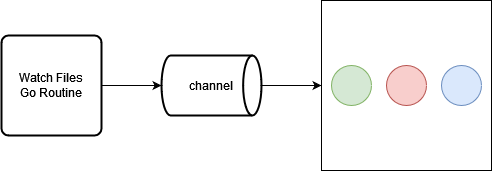

# Docker Auto Rebuild

## Introduction

Docker Auto Rebuild is a **daemon tool**, written in the Go programming language, that watches for changes in your project workspaces then rebuilds a *component* when changes within are detected. Docker Auto Rebuild also supports signals from the command line such as a signal to exit the daemon.

The problem Docker Auto Rebuild solves is the ability to auto-build and redeploy Docker-based projects which have one-to-many *components*. A *component* can be built into a container image and deployed as a container. An example of *components* could include a frontend and a backend to a website. Below shows an example of the directory structure of such a project would look like:
 
```
workspace/
├── componentA/
    ├── Dockerfile
    ├── src/
    ├── ...
├── componentB/
    ├── Dockerfile
    ├── src/
    ├── ...
├── ...
```

## Key Features

There are a few key libraries used by Docker Auto Rebuild that support the tool’s key features. These features include:
- The Daemon and signal events
- File watching
- Optimal component rebuilding

### go-daemon

The [go-daemon](https://github.com/sevlyar/go-daemon) library supports the tool’s ability to run as an event-based daemon which can be triggered by the command line. The core ability of the tool is offloading a service (a daemon) for the auto rebuilding process. The daemon is created at the entry of the command line executable. It then proceeds to create its own process with its own attributes defined by the context:

```go
daemon.Context{
    PidFileName: "name.pid", 
    PidFilePerm: 0644, 
    LogFileName: "name.log", 
    LogFilePerm: 0640, 
    WorkDir: target, 
    Umask: 027, 
    Args: arg,
}
```

In the initial stages of the construction, it first defines the commands for signal handling, such as below: 

```go
daemon.AddCommand(daemon.StringFlag(signal, "quit"), syscall.SIGQUIT, handler) 
```

Optionally second, it invokes `context.Search()` to find the currently running process of the active daemon then invokes `context.SendCommands(daemonProcess)` to send a requested signal to the active daemon for triggering the tied event. The aforementioned only happens when a signal flag is specified, when this happens the program exits after sending the signal, more on this later. 

Third, the daemon is officially created by invoking `context.Reborn()`. If an error occurs, it is reported and the program exits if the daemon was unsuccessfully created. As the first task of the daemon's execution, it will defer the invoke of `context.Release()` to release the process at the end of the daemon’s execution. Everything mentioned further will also be part of the daemon’s execution code. 

Fourth and the bulk of the rest of the daemon’s execution, it runs the worker procedure as a goroutine then lastly runs `daemon.ServeSignals()` to listen out for sent signals and will do so until the daemon is signalled to exit. More information about the overall process of the daemon’s construction can be found [here](https://github.com/sevlyar/go-daemon/blob/master/README.md).

When one uses the command for Docker Auto Build, they can either specify the signal flag `-s` to send signal and exit or not specify the signal flag and create a daemon. Below is the list of signals which can be sent to the daemon via CLI:
- `quit` - Sends a signal to exit the daemon gracefully.
- `stop` - Sends a signal to exit the daemon immediately.
- `redeploy` - Sends a signal to redeploy container(s) which images have been rebuilt.

### fsnotify

### ReactiveX (rxgo)

The [ReactiveX](http://reactivex.io/) ([rxgo](https://github.com/ReactiveX/RxGo)) API was selected for providing observable streams in order to optimize the concurrency of building component container images off of the incoming file change events. While inserting file change events into a channel as mentioned under fsnotify, the prebuild process creates an observable stream which listens to the same channel for events.



Once the observable stream with the pipeline is defined the process then begins iteration which invokes `observable.Observe()` to begin the evaluation of the stream. When a file event is recorded by the watching routine, it is sent through the pipeline filtered and evaluated. One filter in the pipeline of note for optimizing the building process is *debounce*. With *debounce*, rapid recorded file events can be filtered to the latest one of a particular time interval, say one second, so that requests to build are more moderate in size. We can see a visual of *debounce* below:


#### File Hashing/Caching

Another portion of the pipeline of note is the file change comparison filter. File change events can still happen even if the contents of a file are still the same. To combat this, the tool uses a change comparison to filter out file change events in which the files contents remain the same. For as a performance optimization, the tool performs a hash on the file’s name and the file’s content then uses the resultant hash in a comparison with an old hash stored in a memory-based cache. If there is no old hash stored in the cache, the tool assumes the file was never seen before and therefore the corresponding event should be included in consideration for a build.

## Usage

### Start Daemon

```sh
$> auto-rebuild -t examples/docker-project
```

### Send Signal

```sh
$> auto-rebuild -s quit
```

## Conclusion
